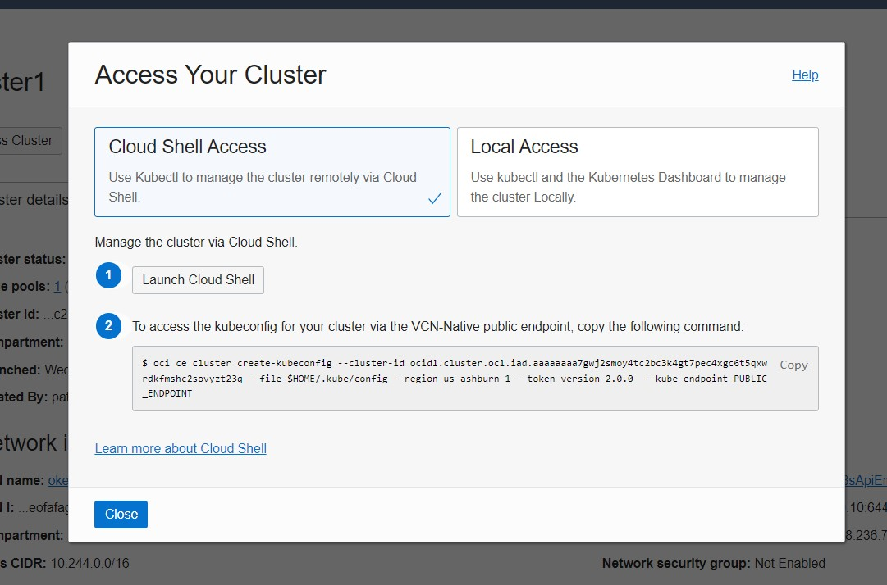
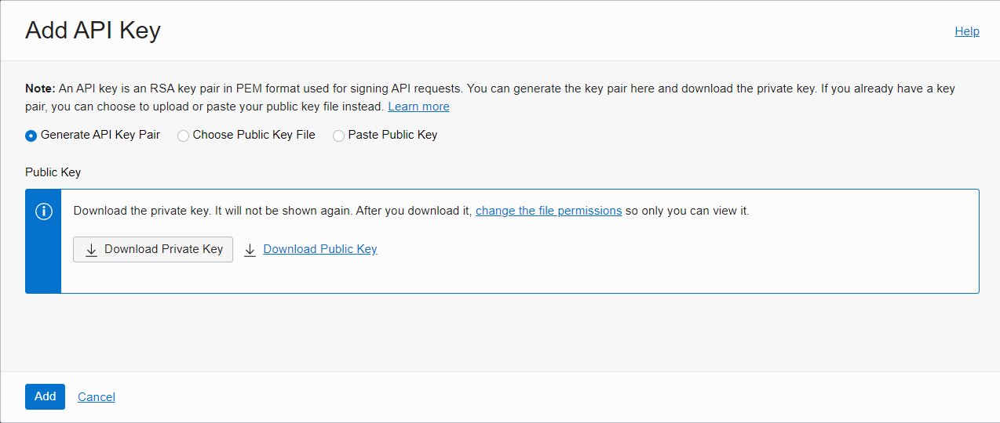
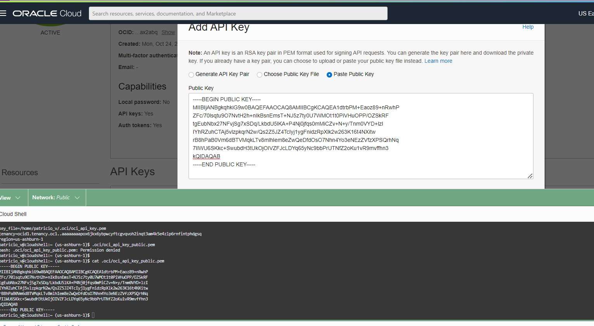
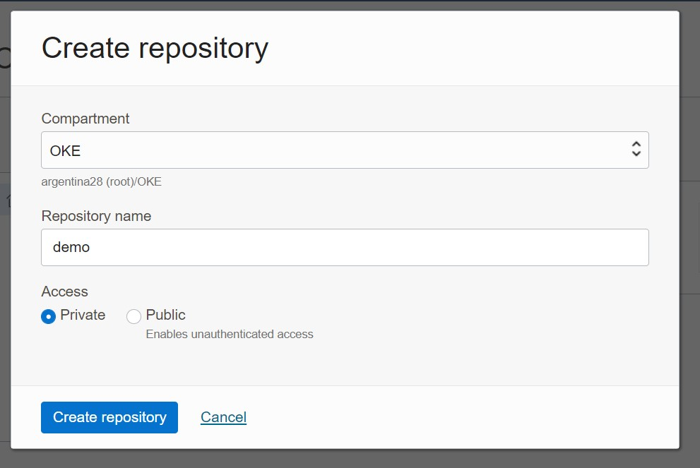

## CI/CD desde Github Actions hacia Oracle OKE

La finalidad de este demo es configurar Github Actions para realizar deploymente de una aplicaicón en Oracle Kubernetes Engine (OKE)


### Requerimientos:

- Cuenta de Oracle Cloud Infrastructure(test gratuito https://www.oracle.com/cloud/free/)
- Cuenta de Github (https://github.com/signup?ref_cta=Sign+up&ref_loc=header+logged+out&ref_page=%2F&source=header-home)

### ¿Qué vamos a hacer?

- Clonar repositorio Github
- Configurar OKE
- Configurar Github Actions
- Despliegue de aplicación
	- Descargar imágen desde dockerhub
	- Crear imágen personalizada de contenedor (compilar)
	- Subirla a OCI registry
	- Instalar app desde Helm
	- Despliegue en Kubernetes
- Modificar aplicación
- Despliegue automático 

### Paso a Paso

1. Crear cluster OKE - 
	Menu -> Developer Services -> Kubernetes Clusters (OKE) -> Quick Create
	

2. Una vez que finalice el proceso, crear kubeconfig
	Acces Cluster -> Cloud Shell Access -> Launch Cloud Shell y copiar el comando, similar a
    ```
    $ oci ce cluster create-kubeconfig --cluster-id <cluster ocid> --file $HOME/.kube/config --region us-ashburn-1 --token-version 2.0.0  --kube-endpoint PUBLIC_ENDPOINT
    ```
    
    
3. Crear OCI Setup Configurar
	```
	Crear config 
	oci setup config
		Definir:
			- Path donde quedará la configuración ~/.oci/NOMBREARCHIVO
			- User OCID		Profile -> oracleidentitycloudservice/XXXXX -> OCID -> Copy
			- Tenancy OCID		Profile -> Tenancy:XXXXX -> OCID -> Copy
			- Region 		
			- Para el resto de los campos dejar las opciones pro default 
	```
3.1 Para validar, hacer cat al archivo de configuración 
	```
	$ cat ~/.oci/NOMBREARCHIVO
		[DEFAULT]
		user=ocid1.user.oc1..XXXXXXX
		fingerprint=XX:XX:XX:XX:XX:XX:XX:XX:XX:XX:XX
		key_file=/home/XXXX/.oci/oci_api_key.pem
		tenancy=ocid1.tenancy.oc1..XXXXXXXX
		region=XX-XXXXX-X
	```
	
4. Crear API Key (permite conectar a kubernetes y realizar el despliegue mediante Helm)
	Menu -> Identity & Security -> User -> User Details -> API Key -> Add API Key -> Past Public Key -> Add
	
	```
		Pegar la public Key
			$ cat .oci/oci_api_key_public.pem
	```
	

4.2 El fingerprint que se crea debe ser el mismo q está en ~/.oci/NOMBREARCHIVO
	```
	$ fgrep "XXXXXX" ~/.oci/NOMBREARCHIVO
	```
	
6. Crear Token (Nos permitirá conectarnos con el OCI Registry)
	Menu -> Identity & Security -> User -> User Details -> Auth Tokens -> Generate Token
	
	Se puede guardar dentro de un archivo llamado token
	```
	$ echo "XXXXXX" > .oci/token
	```
7. Crear registry en OCI
	Menu -> Developer Services -> Container Registry -> Create Repository
	

8. Clonar el repo y configurar los secrets
	Github > Project > Setings > Secrets > Actions
	
	```
		OCI_AUTH_TOKEN					cat ~/.oci/token
		OCI_CLI_FINGERPRINT				cat ~/.oci/NOMBREARCHIVO		fingerprint=d1:e2:  			
		OCI_CLI_KEY_CONTENT				cat ~/.oci/oci_api_key.pem 		Esto se puede validar desde cat ~/.oci/NOMBREARCHIVO   key_file=/home/felipe_bas/.oci/oci_api_key.pem
		OCI_CLI_REGION					cat ~/.oci/NOMBREARCHIVO		region=us-ashburn-1
		OCI_CLI_TENANCY					cat ~/.oci/NOMBREARCHIVO		tenancy=ocid1.tenancy.oc1.
		OCI_CLI_USER					cat ~/.oci/NOMBREARCHIVO		user=ocid1.user.oc1.
		OCI_COMPARTMENT_OCID				Identity & Security > Compartment > $COMPARTMENT_NAME > ocid1.compartment.oc1.
		OCI_DOCKER_REPO					iad.ocir.io/XXXXXX/demo XXXX es en namespace del registry
									Developer Services > OKE > Container Registry > demo > Namespace 
		OKE_CLUSTER_OCID				Developer Services > OKE > $OKE_NAME > ocid1.cluster.oc1.
	```
	

9. Crear namespace
	```
	$ kubectl create namespace demo
	```
	
10. Crear Secret de tipo docker-registry para el namespace
	Para conocer el identificador del registry (XXX.ocir.io) visitar https://docs.oracle.com/en-us/iaas/Content/General/Concepts/regions.htm y buscar el key de la región en la que uno se encuentra ej: Sao Paulo gru, Chile scl, Ashbur iad
	```
	$ kubectl create secret docker-registry ocirsecret --docker-server=XXX.ocir.io --docker-username='<Tenancy name>/<username>' --docker-password='<user auth token>' -n demo
	```

11. Realizar un cambio en nuestro repositorio y esperar que el deploy se realice de forma automática:
	Editar la línea 8 del arhivo githubaction-OKE/chart/demo.yaml y cambiar   **repository: iad.ocir.io/id5lady22ken/demo** por XXX.ocir.io/REGISTRY_NAMESPACE/demo y ver que ocurre

May the force be with you!

12. Validar
	Listar servicios
	```
	$ kubectl get services -n demo
	NAME         TYPE           CLUSTER-IP      EXTERNAL-IP     PORT(S)        AGE
	demo-chart   LoadBalancer   10.96.141.165   129.80.131.252   80:30367/TCP   70s
	```
	Copiar la IP externa en un navegador y enter...

14. Editar la línea 10 del archivo main.py por otro mensaje, nada puede malir sal
	```
	    return {"Hola, ¿cómo estás?"}
	```
